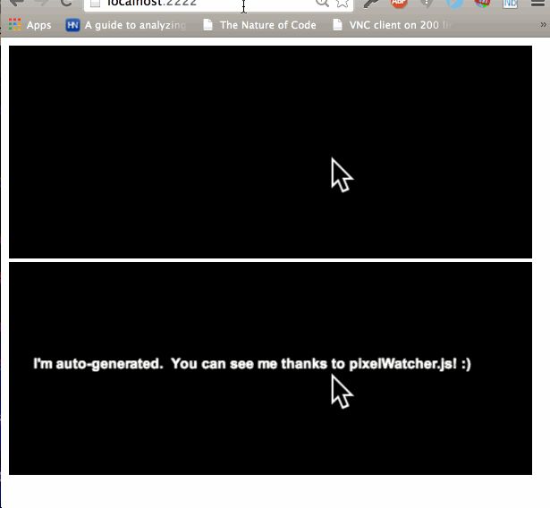

pixel-watcher-js
================
</img>

A library that makes it easy to monitor changes in RGB values within some region of an HTML5 canvas or video object.  Is especially handy for aiding in motion detection and dynamic labeling so that dom elements overlaying a video background aren't camouflaged.

PixelWatcher Options
====================
{
    videoObject: An html5 video or canvas element,
    frameRate: Sampling rate, defaults to 6 fps,
    width: Width of the area you'd like to sample for color changes,
    height: Height of the area you'd like to sample for color changes,
    offsetX: x-offset of the area you'd like to sample for color changes,
    offsetY: y-offset of the area you'd like to sample for color changes
}

